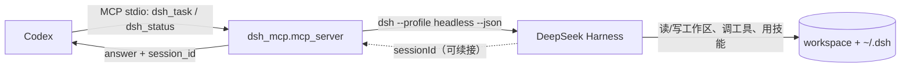

# Codex 通过 MCP 调用 DSH

把本机安装的 **DeepSeek Harness（`dsh`）** 挂成 **MCP server**，Codex 就能像调用内置工具
一样调用它：`dsh_task` 派一个**真实任务**（DSH 用自己的技能、记忆和工作区执行），
`dsh_status` 自检接线。每次调用都会留下一个真实的 DSH 会话，以及一行可审计的调用记录。



> 本机实测：`{"answer": "MCP-OK", "session_id": "session-77f0b613-…", "exit_code": 0}`；
> 端到端流程与排障全过程见 [`docs/codex-mcp-dsh.md`](docs/codex-mcp-dsh.md)。

## 快速开始（三步）

```powershell
# 1) 依赖
uv sync

# 2) 把配置贴进 Codex（把 <DSH_HOME>、<repo> 换成你的路径）
#    完整可复制版本：examples/codex-config.toml
#    ~/.codex/config.toml 里追加 [mcp_servers.dsh] 与 [mcp_servers.dsh.env]

# 3) 验证——二选一
python scripts\mcp_smoke.py --task "Reply with exactly: MCP-OK"   # 命令行验证
# 或在 Codex 里说：Call the dsh_status tool exactly once, then reply with the raw JSON
```

`~/.codex/config.toml` 的内容（路径改成你自己的）：

```toml
[mcp_servers.dsh]
command = '<DSH_HOME>\dsh-runtimes\dsh-primary-runtime\dependencies\python\python.exe'
args = ["-m", "dsh_mcp.mcp_server"]
startup_timeout_sec = 120

[mcp_servers.dsh.env]
PYTHONPATH = '<repo>\src;<repo>\.venv\Lib\site-packages;<repo>\.venv\Lib\site-packages\win32;<repo>\.venv\Lib\site-packages\win32\lib'
DSH_MCP_WORKDIR = '<repo>'
DSH_MCP_STATE_DIR = '<repo>\.dsh-a2a'
DSH_MCP_CALL_LOG = '<repo>\logs\mcp_calls.jsonl'
```

改完 Codex 的配置**要重启 Codex** 才生效。

## 两个工具

| 工具 | 签名 | 作用 |
| --- | --- | --- |
| `dsh_task` | `prompt`, `session_id?`, `timeout_seconds?`, `json_output?` | 跑一个任务并返回最终答复；把返回的 `session_id` 传回来即**续接同一会话**；`json_output=true` 时额外返回 session / exit_code / usage |
| `dsh_status` | `probe_boot?` | 报告解析到的 launcher、profile、工作区、状态目录；`probe_boot=true` 时顺带做一次 profile 预检 |

工具面刻意只有两个——每个工具的 schema 每轮都要付上下文成本。

## 配置为什么长这样（三个必填点）

| 点 | 缺了会怎样 |
| --- | --- |
| `command` 用**工作区外**的解释器 | 工作区内的 `.venv` 受 Windows 沙箱限制，它派生的 `dsh` 写不了 `~/.dsh` → `EPERM … cordis.yml`，每次任务都失败 |
| `env.PYTHONPATH` | 运行时解释器里没有 `dsh_mcp` 这个包（它是本仓库源码）→ server 启动即 `ModuleNotFoundError: No module named 'dsh_mcp'` |
| `PYTHONPATH` 里带 `win32` 与 `win32\lib` | `mcp` 2.x 在 Windows 上 import `pywintypes`（pywin32），而 pywin32 靠 `.pth` 注入路径——`PYTHONPATH` 不处理 `.pth` → `No module named 'pywintypes'` |

## 排障：失败长什么样

**最坑的一种是静默失败**：少写 `env` 时 Codex 不会报"服务器起不来"，它只是拿不到工具，
模型会说"我的工具列表里没有 `dsh_status`"（MCP 只返回空 resources）。

诊断第一条命令：

```powershell
& '<DSH_HOME>\dsh-runtimes\dsh-primary-runtime\dependencies\python\python.exe' -m dsh_mcp.mcp_server --check
# 正常：打印 launcher / profile / workdir / state dir
```

| 现象 | 原因 | 处理 |
| --- | --- | --- |
| 模型看不到 `dsh_status` / 只有空 resources | 配置缺 `env`，server 启动即崩 | 补 `[mcp_servers.dsh.env]`，见上；用 `--check` 复现 |
| `ModuleNotFoundError: No module named 'dsh_mcp'` | 解释器里没装本仓库源码 | `PYTHONPATH` 加 `<repo>\src` |
| `No module named 'pywintypes'` | 少了 pywin32 的两个目录 | `PYTHONPATH` 加 `…\site-packages\win32;…\site-packages\win32\lib` |
| `EPERM … .dsh\profiles\…\cordis.yml` | 解释器在工作区内（沙箱限制） | 换工作区外的解释器（如上），或把 `DSH_MCP_DSH_HOME` 指到可写目录 |
| `could not start … piped stdio: WinError 5` | 在沙箱里跑 | 在普通终端里跑 |
| 改完配置没反应 | MCP server 在 Codex 启动时拉起 | 重启 Codex |

## 调用记录（审计"谁调过我"）

每次工具调用都会追加一行 JSONL（`DSH_MCP_CALL_LOG`，默认 `logs\mcp_calls.jsonl`）：

```powershell
python scripts\mcp_calls.py --all
```

```
when (local)         tool        ok         ms  session                prompt
2026-10-05 21:29:53  dsh_status  ok          -
2026-10-05 21:29:57  dsh_task    ok       3875  session-1d31559f-…     Reply with exactly: CALL-LOG-OK
```

记录字段：`ts`(UTC) / `tool` / `ok` / `duration_ms` / `prompt_preview` / `session_id` /
`exit_code` / `usage`，失败时记诊断后的 `error`。要进一步取证（模型是否**看到**工具、
每次任务对应的真实 DSH 会话目录等），看
[`docs/codex-mcp-dsh.md`](docs/codex-mcp-dsh.md) 的"调用记录在哪查"一节。

## 目录结构（MCP 相关）

```
src/dsh_mcp/
  mcp_server.py     MCP server：两个工具 + 调用审计（stdio / streamable-http）
  dsh_runner.py     执行 `dsh --profile headless --json`，解析事件、超时、取消
  config.py         环境变量、launcher 探测（自动跳过失效 shim）
  session_store.py  session_id 的持久化（支持续接）
  stub_runner.py    假执行体（`--stub`，用来零成本验证客户端接线）
scripts/
  mcp_smoke.py      真实 MCP 客户端：列工具 + dsh_status + 可选跑一个任务
  mcp_calls.py      调用记录查看器
  fake_dsh.py       离线测试用的假 launcher
tests/              16 条契约测试（离线可跑）
examples/           Codex TOML / 通用 stdio JSON / WorkBuddy HTTP
docs/               端到端流程与实测记录
start-mcp.cmd       HTTP 传输启动器（默认 http://127.0.0.1:9102/mcp）
_common.cmd         解释器与 PYTHONPATH 解析（工作区外解释器 + pywin32 目录）
```

- HTTP 传输（给只吃远端 URL 的客户端，如 WorkBuddy 的 `mcp.json`）：
  `.\start-mcp.cmd` → `{"mcpServers": {"dsh": {"url": "http://127.0.0.1:9102/mcp"}}}`
- 契约测试：`uv run pytest -q`（16 passed）；CI 见 `.github/workflows/ci.yml`（windows-latest）。

## 许可

MIT，见 [LICENSE](LICENSE)。
