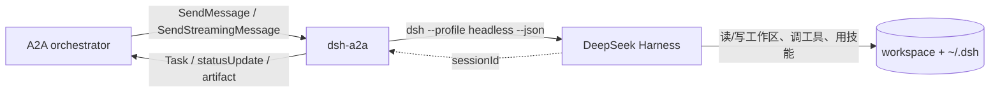

# dsh-a2a — DeepSeek Harness as an A2A agent

把本机安装的 **DeepSeek Harness（`dsh`）** 包成一个标准的 **A2A（Agent2Agent）**
agent：任何会说 A2A 的 orchestrator（WorkBuddy、codex-a2a、自写的客户端、其他框架）
都能通过 Agent Card 发现它、给它派活，并把执行过程（调了哪个工具、结果如何）
与最终答复作为 A2A 状态更新和 artifact 收回去。

与 `codex-a2a` 的区别：执行体不是 Codex CLI，而是 **本机的 dsh headless profile** ——
同一个 harness、同一份技能（`~/.dsh/skills`）、同一份记忆与凭据配置。



## 已验证的行为

本机（Windows / Python 3.12.14 / a2a-sdk 1.2.1 / dsh 0.2.0-rc.2）实测：

| 能力 | 验证方式 | 结果 |
| --- | --- | --- |
| 启动器探测 | 对真实 shim 跑 `--version` | 失效 shim（`Harness CLI not found`，exit 1）被拒；可用 launcher 返回 `0.2.0-rc.2` 被采纳 |
| Agent Card | 真机 HTTP `GET /.well-known/agent-card.json` | 200，含 `supportedInterfaces`（JSONRPC + HTTP+JSON）/ `skills` / `capabilities` |
| 鉴权 | 真机 HTTP：无 token / 有 token | RPC 401（带 `WWW-Authenticate`）/ 200，Agent Card 与 `/healthz` 保持公开 |
| JSON-RPC 非流式 | 真机 HTTP `SendMessage` + `GetTask` 轮询 | `TASK_STATE_COMPLETED`，artifact `dsh-response` 返回最终答复 |
| 过程回传 | 真机任务历史断言 | `$ read_file {"path": "README.md"}` 与 `✓ read_file finished` 均出现在历史里 |
| 会话续接 | 同一 `contextId` 第二次调用 | 状态消息显示 `resuming session session-stub-0001`，artifact metadata `continuedSession=true`、`dshSessionId` 与首轮一致，`sessions.json` 落盘 |
| 失败映射 | 契约测试（runner 抛错） | `TASK_STATE_FAILED`，消息带失败原因 |
| 事件解析 | `tests/test_contract.py` | 8 passed / 3 skipped（见下） |

**尚未在真机验证的一步**：真正跑一次模型任务（`dsh --profile headless` 真执行）。
原因：DSH 的 Windows 沙箱禁止子进程使用重叠命名管道（`WinError 5`），并禁止写
`~/.dsh`，而这一步两者都需要。请在你的普通终端里跑：

```powershell
cd D:\DS-harness\.dsh-a2a
uv run pytest -q                      # 3 个被沙箱跳过的用例会真正跑起来
uv run dsh-a2a --once "用一句话说明这个目录是做什么的"
```

`--once` 正常时应打印 dsh 的答复，并在 stderr 给出 `[session session-… exit 0]`。

## 快速开始

```powershell
cd D:\DS-harness\.dsh-a2a

# 1) 依赖（uv 建虚拟环境并锁定版本）
uv sync

# 2) 看一眼探测到的配置（启动器、profile、工作区、鉴权）
uv run dsh-a2a --check

# 3) 启动（默认 http://127.0.0.1:9101）
$env:DSH_A2A_TOKEN = "choose-a-token"      # 可选：不设则本机免鉴权
uv run dsh-a2a
```

检查 Agent Card：

```powershell
curl.exe http://127.0.0.1:9101/.well-known/agent-card.json
```

不想启动服务、只想验证「A2A → dsh」这一段能跑通：

```powershell
uv run dsh-a2a --once "用一句话说明这个目录是做什么的"
uv run dsh-a2a --once "统计 README 里的小节数量" --json
```

## 从 A2A 客户端调用

```powershell
# 最小客户端：发现卡片 → 发任务 → 轮询到终态 → 打印 artifact
uv run python scripts\a2a_smoke.py "总结这个工作区的 TODO"

# 用同一个 contextId 追问，dsh 会 resume 同一个 session
uv run python scripts\a2a_smoke.py "刚才那个结论有什么风险？" --context-id <上一步打印的 context>
```

或任意 A2A 客户端（camelCase + `A2A-Version: 1.0` 头）：

```jsonc
// POST http://127.0.0.1:9101/
{
  "jsonrpc": "2.0",
  "id": "1",
  "method": "SendMessage",
  "params": {
    "message": {
      "messageId": "5f1c...",
      "role": "ROLE_USER",
      "parts": [{ "text": "把这个目录里的报告合并成一份摘要" }]
    }
  }
}
```

## 协议映射

`dsh --profile headless --json` 的事件（见 `@deepseek-ai/dsh-headless`
的 `json-stream`）到 A2A 的映射：

| dsh `--json` 事件 | A2A 表现 |
| --- | --- |
| `session`（`sessionId`） | 记住 session，绑定到本次 `contextId`；后续轮次用它 `--session-id` |
| `status` `turn_start` | `TASK_STATE_WORKING`：`turn N started` |
| `tool_call` | `statusUpdate`：`$ <tool> <input 截断>` |
| `tool_result` | `statusUpdate`：`✓/✗ <tool> finished` + 结果片段，metadata 带工具名与状态 |
| `text` | `statusUpdate`：assistant 已提交的文本 |
| `thinking` | `statusUpdate`：`(thinking) …`（截断到 400 字符） |
| `status` `step_end`（含 usage） | 累加 token 用量，最终写进 artifact metadata |
| `final` | artifact `dsh-response`（无损最终答复）+ `TASK_STATE_COMPLETED` |
| 进程非 0 退出 / 超时 | `TASK_STATE_FAILED`，消息带 stderr 末行 |
| `tasks/cancel` | 终止 dsh 子进程，`TASK_STATE_CANCELED`（已写入的文件不回滚） |

## 配置项

全部通过 `DSH_A2A_*` 环境变量控制：

| 变量 | 默认值 | 说明 |
| --- | --- | --- |
| `DSH_A2A_WORKDIR` | 当前目录 | dsh 的工作区，也是子进程 cwd |
| `DSH_A2A_HOST` / `DSH_A2A_PORT` | `127.0.0.1` / `9101` | 监听地址 |
| `DSH_A2A_PUBLIC_URL` | `http://host:port` | 写进 Agent Card 的对外地址（反代后要改） |
| `DSH_A2A_DSH_BIN` | 自动探测 | dsh 启动器（`dsh.cmd` 全路径） |
| `DSH_A2A_DSH_HOME` | 继承 `DSH_HOME` | dsh 的配置/技能/凭据目录，默认 `~/.dsh` |
| `DSH_A2A_PROFILE` | `headless` | 要 boot 的 profile |
| `DSH_A2A_TIMEOUT_SECONDS` | `1800` | 单轮超时，超时杀进程并置 FAILED |
| `DSH_A2A_TOKEN` | 未设置 | 设置后启用 Bearer 鉴权（Agent Card 除外） |
| `DSH_A2A_MAX_CONCURRENCY` | `2` | 同时运行几个 dsh 进程 |
| `DSH_A2A_STATE_DIR` | `<workdir>/.dsh-a2a` | `sessions.json`（contextId → sessionId）落盘位置 |
| `DSH_A2A_V0_3_COMPAT` | `true` | 同一端点兼容 A2A 0.3 客户端（`message/send`） |
| `DSH_A2A_EXTRA_ARGS` | 空 | 追加给 launcher 的参数 |

dsh 自身的模型、provider、凭据来自 `$DSH_HOME`（`config`/`.credentials.yaml`），
本项目不做任何凭据处理。

## 目录结构

```
src/dsh_a2a/
  config.py         环境变量与 dsh 启动器探测（含 --version 探针）
  agent_card.py     Agent Card（supportedInterfaces / skills / 可选 bearer 声明）
  dsh_runner.py     子进程 + NDJSON 事件解析、用量累加、超时、取消
  executor.py       A2A AgentExecutor：事件映射与会话续接
  session_store.py  contextId → dsh sessionId 的持久化
  app.py            Starlette 路由 + 鉴权中间件
  main.py           CLI（服务 / --check / --print-card / --once）
scripts/a2a_smoke.py  最小 A2A 客户端（冒烟）
scripts/fake_dsh.py   离线测试用的假 launcher
tests/test_contract.py 契约测试（离线，11 项）
tools/asar-extract.js  从 app.asar 里取 DSH 内部文档/入口（升级后重新查证用）
```

## 已知限制

- **任务存储是内存态**：重启后 `GetTask` 查不到历史任务（`sessions.json` 只保证会话续接）。
- **一次一个任务**：dsh headless 每次处理一个任务后退出；多步工作要拆成多次调用。
- **续接受 cwd 与 preset 约束**：`--session-id` 会拒绝记录在其它工作目录、或属于 subagent/fork 的 session，因此 `DSH_A2A_WORKDIR` 不要随意改。
- **取消是尽力而为**：`tasks/cancel` 会终止 dsh 子进程，已经写入的文件改动不会回滚。
- **并发共享同一 `DSH_HOME`**：多个任务同时跑会共用技能与凭据目录；`max_concurrency` 默认 2。
- **没有 push notification**：`pushNotifications: false`，长任务请用 SSE 或轮询。
- **依赖本机 dsh 安装**：找不到可用启动器时启动即失败（用 `--check` 先确认）。
