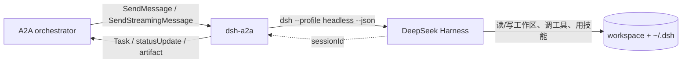

# dsh-a2a — DeepSeek Harness as an A2A agent

把本机安装的 **DeepSeek Harness（`dsh`）** 包成一个标准的 **A2A（Agent2Agent）**
agent：任何会说 A2A 的 orchestrator（WorkBuddy、codex-a2a、自写的客户端、其他框架）
都能通过 Agent Card 发现它、给它派活，并把执行过程（调了哪个工具、结果如何）
与最终答复作为 A2A 状态更新和 artifact 收回去。

与 `codex-a2a` 的区别：执行体不是 Codex CLI，而是 **本机的 dsh headless profile** ——
同一个 harness、同一份技能（`~/.dsh/skills`）、同一份记忆与凭据配置。



## 已验证的行为

本机（Windows / Python 3.12.14 / a2a-sdk 1.2.1 / dsh 0.2.0-rc.2）实测：

| 能力 | 验证方式 | 结果 |
| --- | --- | --- |
| 启动器探测 | 对真实 shim 跑 `--version` | 失效 shim（`Harness CLI not found`，exit 1）被拒；可用 launcher 返回 `0.2.0-rc.2` 被采纳 |
| Agent Card | 真机 HTTP `GET /.well-known/agent-card.json` | 200，含 `supportedInterfaces`（JSONRPC + HTTP+JSON）/ `skills` / `capabilities` |
| 鉴权 | 真机 HTTP：无 token / 有 token | RPC 401（带 `WWW-Authenticate`）/ 200，Agent Card 与 `/healthz` 保持公开 |
| JSON-RPC 非流式 | 真机 HTTP `SendMessage` + `GetTask` 轮询 | `TASK_STATE_COMPLETED`，artifact `dsh-response` 返回最终答复 |
| 过程回传 | 真机任务历史断言 | `$ read_file {"path": "README.md"}` 与 `✓ read_file finished` 均出现在历史里 |
| 会话续接 | 同一 `contextId` 第二次调用 | 状态消息显示 `resuming session session-stub-0001`，artifact metadata `continuedSession=true`、`dshSessionId` 与首轮一致，`sessions.json` 落盘 |
| 失败映射 | 契约测试（runner 抛错） | `TASK_STATE_FAILED`，消息带失败原因 |
| 事件解析 | `tests/test_contract.py` | 8 passed / 3 skipped（见下） |
| **真实模型任务** | 外部 A2A 客户端 → 桥接 → `dsh --profile headless` | `TASK_STATE_COMPLETED`，`artifact dsh-response = PONG`，真实用量 7,688 token，真实 `dshSessionId` |
| **真实会话续接** | 同 `contextId` 连发两轮 | 首轮「记住 7391」→ 次轮「那个数字是多少」→ 答复 **7391**，状态显示 `resuming session session-2a75a35a…`、`turn 2 started`，metadata `continuedSession=true` |

**真机验证是怎么做的**：桥接与 dsh 子进程都必须跑在**无沙箱**环境，而本会话自身在 DSH 的
Windows 沙箱里。验证时用了一条提权命令启动桥接，并把 `DSH_A2A_DSH_HOME` 指向工作区内的
临时 DSH home（沙箱组的 ACE 让受限子进程无法写 `~/.dsh`；工作区内可写）。你平时在自己终端
里跑不需要这些：普通终端没有沙箱，直接用默认 `~/.dsh` 即可。

```powershell
# 运维者常用入口
uv run dsh-a2a --check        # 探测启动器 / profile / 工作区 / 鉴权
uv run dsh-a2a --once "ping"  # 不经过 A2A，直接验证 dsh 这一侧
uv run dsh-a2a --stub         # 假执行体，验证 A2A 客户端接线（零 token 成本）
```

## 脚本族（双击即可，推荐）

| 脚本 | 用途 |
| --- | --- |
| **`start-bg.cmd`** | 后台启动：自动等健康检查、打印 Agent Card、用浏览器打开卡片；已在跑则只打开卡片 |
| `start.cmd` | 前台运行（看实时日志，Ctrl+C 停） |
| `stop.cmd` | 停掉占用该端口的实例 |
| `status.cmd` | 健康检查 + Agent Card + 任务列表 |
| `config.cmd` | 改端口 / 工作区 / token / profile / dsh launcher / 解释器 |
| `_common.cmd` | 共享引导：默认值、卡片地址，以及**解释器解析**（见下） |

`_common.cmd` 会自动选解释器：优先用工作区外的 DSH 运行时 Python
（`%DSH_HOME%\dsh-runtimes\dsh-primary-runtime\dependencies\python\python.exe`）+ 工作区
`src`／site-packages 走 `PYTHONPATH`；找不到才回落到 `.venv`。这一步不是可选项——
工作区内的 `.venv` 解释器受沙箱限制，用它起的 `dsh` 写不了 `~/.dsh`，任务必然 `EPERM`。

日志在 `logs\server.out.log`、`logs\server.err.log`。

## 快速开始

```powershell
cd D:\DS-harness\.dsh-a2a

# 1) 依赖（uv 建虚拟环境并锁定版本）
uv sync

# 2) 看一眼探测到的配置 + profile 预检（启动器、profile、工作区、鉴权）
.\run.ps1 --check

# 3) 启动（默认 http://127.0.0.1:9101）
.\run.ps1
# 可选鉴权：先 $env:DSH_A2A_TOKEN="choose-a-token" 再启动
```

> **为什么用 `.\run.ps1` 而不是 `uv run dsh-a2a`**：`.venv` 建在工作区里，而
> **工作区内的解释器被 DSH 的 Windows 沙箱限制**——由它派生的 `dsh` 子进程写不了
> `~/.dsh/profiles/headless/cordis.yml`，每次调用都会 `EPERM` 失败（无论你在自己终端
> 还是让 agent 启动）。`run.ps1` 改用工作区外的 DSH 运行时 Python + 工作区内的
> site-packages（`PYTHONPATH`），实测 `profile boot : OK` 且真机任务通过。
> 若你的机器没有 DSH 运行时，脚本会自动回落到 venv（此时请把桥接跑在普通终端）。

检查 Agent Card：

```powershell
curl.exe http://127.0.0.1:9101/.well-known/agent-card.json
```

不想启动服务、只想验证「A2A → dsh」这一段能跑通：

```powershell
uv run dsh-a2a --once "用一句话说明这个目录是做什么的"
uv run dsh-a2a --once "统计 README 里的小节数量" --json
```

## 从 A2A 客户端调用

```powershell
# 最小客户端：发现卡片 → 发任务 → 轮询到终态 → 打印 artifact
uv run python scripts\a2a_smoke.py "总结这个工作区的 TODO"

# 用同一个 contextId 追问，dsh 会 resume 同一个 session
uv run python scripts\a2a_smoke.py "刚才那个结论有什么风险？" --context-id <上一步打印的 context>
```

或任意 A2A 客户端（camelCase + `A2A-Version: 1.0` 头）：

```jsonc
// POST http://127.0.0.1:9101/
{
  "jsonrpc": "2.0",
  "id": "1",
  "method": "SendMessage",
  "params": {
    "message": {
      "messageId": "5f1c...",
      "role": "ROLE_USER",
      "parts": [{ "text": "把这个目录里的报告合并成一份摘要" }]
    }
  }
}
```

## 让 WorkBuddy 调用 DSH

WorkBuddy 通过**技能**（`~/.workbuddy-ai/skills/<name>/`）扩展，本仓库带一份现成的：

```
workbuddy-skill/
  SKILL.md                 技能说明（含触发场景、前置检查、用法）
  scripts/dsh_a2a.py       A2A 客户端（仅标准库，任意 Python 3 可跑）
```

安装（已在本机装好，源文件保留在仓库里便于更新）：

```powershell
Copy-Item D:\DS-harness\.dsh-a2a\workbuddy-skill\SKILL.md `
          C:\Users\a1299\.workbuddy-ai\skills\dsh-a2a\ -Force
Copy-Item D:\DS-harness\.dsh-a2a\workbuddy-skill\scripts\dsh_a2a.py `
          C:\Users\a1299\.workbuddy-ai\skills\dsh-a2a\scripts\ -Force
```

**使用**（先确保桥接在跑）：

```powershell
# 1) 普通终端里启动桥接（用你真实的 ~/.dsh：技能、记忆、凭据都在）
cd D:\DS-harness\.dsh-a2a
uv run dsh-a2a                       # 若设了 token：$env:DSH_A2A_TOKEN="…" 后再启动

# 2) WorkBuddy 侧：直接说「让 DSH 做 …」，它会读技能并执行下面这条
python "C:\Users\a1299\.workbuddy-ai\skills\dsh-a2a\scripts\dsh_a2a.py" send "你的任务"
```

两条命令各有用途：`card` 先确认连通，`send "…" --context-id <ctx>` 续接上一轮会话。

**已验证**（WorkBuddy 自带的 a2a 环境解释器实测）：第一轮 `Remember the code 4482. Reply with exactly: SAVED` → `SAVED`；第二轮同 `contextId` 问「那个 code 是多少」→ 答 **4482**，状态显示 `turn 2 started`、会话为 `session-4b030533…`（`· 续接`）。

> 桥接必须能写它使用的 DSH home。在**普通终端**启动时就是你真实的 `~/.dsh`；
> 若从 DSH 会话内部启动（子进程继承沙箱受限令牌，`~/.dsh` 只读），需要把
> `DSH_A2A_DSH_HOME` 指到可写目录——这条路径也已验证通过。

### 同时暴露为 MCP（工具面见下节）

`dsh-a2a` 现在两种协议都在：A2A 给 agent 用，MCP 给客户端用。见
[MCP facade](#mcp-facade让客户端把-dsh-当原生工具)。

## MCP facade（让客户端把 DSH 当原生工具）

同一套执行器，第二种协议：**A2A 给 agent 用，MCP 给客户端用**
（WorkBuddy / Codex / Claude Code / Cursor / Cherry Studio / Kimi…）。

| 工具 | 作用 |
| --- | --- |
| `dsh_task(prompt, session_id?, timeout_seconds?, json_output?)` | 跑一个任务并返回最终答复；传回 `session_id` 续接同一会话；`json_output=true` 额外返回 session / exit_code / usage |
| `dsh_status(probe_boot?)` | 报告解析到的 launcher、profile、工作区、状态目录；`probe_boot=true` 顺带做一次 profile 预检 |

工具面刻意只有两个——每个工具的 schema 每轮都要付上下文成本。

**stdio（多数客户端）** —— `command` 用**工作区外的解释器**，`PYTHONPATH` 同时覆盖
`src`、site-packages 与 pywin32 的两个目录（`mcp` 2.x 在 Windows 上 import
`pywintypes`，而 `PYTHONPATH` 不处理 `.pth`）：

```jsonc
{"mcpServers": {"dsh": {
  "command": "<DSH_HOME>\\dsh-runtimes\\dsh-primary-runtime\\dependencies\\python\\python.exe",
  "args": ["-m", "dsh_a2a.mcp_server"],
  "env": {"PYTHONPATH": "<项目>\\src;<项目>\\.venv\\Lib\\site-packages;<项目>\\.venv\\Lib\\site-packages\\win32;<项目>\\.venv\\Lib\\site-packages\\win32\\lib"}
}}}
```

- Codex：`~/.codex/config.toml` 的 `[mcp_servers.dsh]` + `command`/`args`/`env`。
- DSH 自己：`profiles\desktop\cordis.patch.yml` 追加一条 `@deepseek-ai/dsh-mcp-client`，`transport: stdio`。

**streamable-http（只吃远端 URL 的客户端，如 WorkBuddy）**：

```powershell
.\start-mcp.cmd                  # 默认 http://127.0.0.1:9102/mcp
```
```jsonc
// WorkBuddy: connectors-marketplace\connectors\dsh\mcp.json
{"mcpServers": {"dsh": {"url": "http://127.0.0.1:9102/mcp"}}}
```

**验证（两条传输都真机跑过）**：

```powershell
python scripts\mcp_smoke.py --task "Reply with exactly: MCP-OK"          # stdio → MCP-OK
python scripts\mcp_smoke.py --http http://127.0.0.1:9102/mcp --task "…"  # http  → MCP-HTTP-OK
```

## 协议映射

`dsh --profile headless --json` 的事件（见 `@deepseek-ai/dsh-headless`
的 `json-stream`）到 A2A 的映射：

| dsh `--json` 事件 | A2A 表现 |
| --- | --- |
| `session`（`sessionId`） | 记住 session，绑定到本次 `contextId`；后续轮次用它 `--session-id` |
| `status` `turn_start` | `TASK_STATE_WORKING`：`turn N started` |
| `tool_call` | `statusUpdate`：`$ <tool> <input 截断>` |
| `tool_result` | `statusUpdate`：`✓/✗ <tool> finished` + 结果片段，metadata 带工具名与状态 |
| `text` | `statusUpdate`：assistant 已提交的文本 |
| `thinking` | `statusUpdate`：`(thinking) …`（截断到 400 字符） |
| `status` `step_end`（含 usage） | 累加 token 用量，最终写进 artifact metadata |
| `final` | artifact `dsh-response`（无损最终答复）+ `TASK_STATE_COMPLETED` |
| 进程非 0 退出 / 超时 | `TASK_STATE_FAILED`，消息带 stderr 末行 |
| `tasks/cancel` | 终止 dsh 子进程，`TASK_STATE_CANCELED`（已写入的文件不回滚） |

## 配置项

全部通过 `DSH_A2A_*` 环境变量控制：

| 变量 | 默认值 | 说明 |
| --- | --- | --- |
| `DSH_A2A_WORKDIR` | 当前目录 | dsh 的工作区，也是子进程 cwd |
| `DSH_A2A_HOST` / `DSH_A2A_PORT` | `127.0.0.1` / `9101` | 监听地址 |
| `DSH_A2A_PUBLIC_URL` | `http://host:port` | 写进 Agent Card 的对外地址（反代后要改） |
| `DSH_A2A_DSH_BIN` | 自动探测 | dsh 启动器（`dsh.cmd` 全路径） |
| `DSH_A2A_DSH_HOME` | 继承 `DSH_HOME` | dsh 的配置/技能/凭据目录，默认 `~/.dsh` |
| `DSH_A2A_PROFILE` | `headless` | 要 boot 的 profile |
| `DSH_A2A_TIMEOUT_SECONDS` | `1800` | 单轮超时，超时杀进程并置 FAILED |
| `DSH_A2A_TOKEN` | 未设置 | 设置后启用 Bearer 鉴权（Agent Card 除外） |
| `DSH_A2A_MAX_CONCURRENCY` | `2` | 同时运行几个 dsh 进程 |
| `DSH_A2A_STATE_DIR` | `<workdir>/.dsh-a2a` | `sessions.json`（contextId → sessionId）落盘位置 |
| `DSH_A2A_V0_3_COMPAT` | `true` | 同一端点兼容 A2A 0.3 客户端（`message/send`） |
| `DSH_A2A_EXTRA_ARGS` | 空 | 追加给 launcher 的参数 |
| `DSH_A2A_DEBUG_DIR` | 未设置 | 设置后每次运行把启动命令、退出码与原始 stdout/stderr 落盘（排查用） |

## 排障

| 症状 | 原因与处理 |
| --- | --- |
| 任务 `FAILED`，消息含 `EPERM … ~/.dsh/profiles/…/cordis.yml` | **根因：解释器被限制**。工作区内的 `.venv` 解释器受 DSH 沙箱约束，它派生的 `dsh` 子进程写不了工作区外的 `~/.dsh`。用 `.\run.ps1` 启动（工作区外的 DSH 运行时 Python + 工作区 site-packages），或把桥接跑在普通终端并用工作区外的解释器；也可让 `DSH_A2A_DSH_HOME` 指向可写目录 |
| 调用方只看到 `DSH could not finish the task: Node.js v24.18.1` | v1.0.0 之前只回传 stderr 最后一行（Node 崩溃尾巴），信息量为零。升级后同一场景直接给出 `Error: EPERM … cordis.yml` 与修复建议；也可先用 `.\run.ps1 --check`，看 `profile boot` 一行提前发现 |
| 任务 `FAILED`，消息含 `could not start … piped stdio: WinError 5` | 同上：沙箱禁止子进程重叠命名管道。必须在无沙箱环境运行 |
| stderr 出现 `spill-local … EPERM mkdtemp …Temp\dsh-spill-XXXXXX`（`1 entry did not activate`） | 受限子进程不能写系统 TEMP；把 `TEMP`/`TMP` 指向工作区可消除该警告（不影响任务结果） |
| `Could not find a working dsh launcher` | 桌面应用未安装 CLI，或 shim 指向旧安装目录；用 `DSH_A2A_DSH_BIN` 指向 `…\resources\runtime\cli\bin\dsh.cmd` |

dsh 自身的模型、provider、凭据来自 `$DSH_HOME`（`config`/`.credentials.yaml`），
本项目不做任何凭据处理。

## 目录结构

```
src/dsh_a2a/
  config.py         环境变量与 dsh 启动器探测（含 --version 探针）
  agent_card.py     Agent Card（supportedInterfaces / skills / 可选 bearer 声明）
  dsh_runner.py     子进程 + NDJSON 事件解析、用量累加、超时、取消
  executor.py       A2A AgentExecutor：事件映射与会话续接
  session_store.py  contextId → dsh sessionId 的持久化
  app.py            Starlette 路由 + 鉴权中间件
  main.py           CLI（服务 / --check / --print-card / --once）
scripts/a2a_smoke.py  最小 A2A 客户端（冒烟）
scripts/fake_dsh.py   离线测试用的假 launcher
tests/test_contract.py 契约测试（离线，11 项）
tools/asar-extract.js  从 app.asar 里取 DSH 内部文档/入口（升级后重新查证用）
```

## 已知限制

- **任务存储是内存态**：重启后 `GetTask` 查不到历史任务（`sessions.json` 只保证会话续接）。
- **一次一个任务**：dsh headless 每次处理一个任务后退出；多步工作要拆成多次调用。
- **续接受 cwd 与 preset 约束**：`--session-id` 会拒绝记录在其它工作目录、或属于 subagent/fork 的 session，因此 `DSH_A2A_WORKDIR` 不要随意改。
- **取消是尽力而为**：`tasks/cancel` 会终止 dsh 子进程，已经写入的文件改动不会回滚。
- **并发共享同一 `DSH_HOME`**：多个任务同时跑会共用技能与凭据目录；`max_concurrency` 默认 2。
- **没有 push notification**：`pushNotifications: false`，长任务请用 SSE 或轮询。
- **依赖本机 dsh 安装**：找不到可用启动器时启动即失败（用 `--check` 先确认）。
